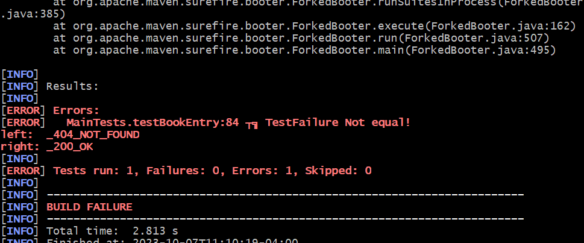
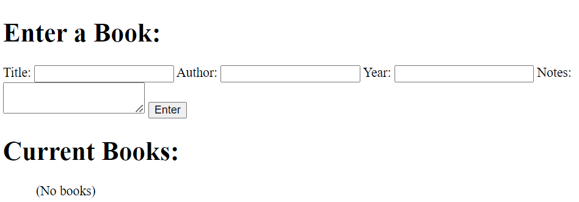
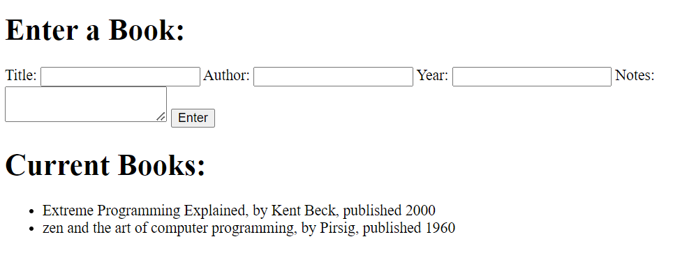

Getting Started, Part 4
=======================

This document is the fourth and final part of the getting started
tutorial, after [part 3](getting_started_part_3.md).

We are going to incorporate templating, database, and more sophisticated
HTTP behaviors in this next step.  Buckle up!

To demonstrate system capabilities without obscuring their
essence, we will develop an intentionally simple application.  It 
will merely keep track of books as you enter them.

The requirement goes like this:

So that we can keep track of the books in our personal library, our system
will have a form for entering each book's data.  It will look like this:
    
    Enter a book:
    -------------
    Title:   [ Dandelion Wine     ]
    Author:  [ Ray Bradbury       ]
    Year:    [ 1999 ]
    Notes:   [ paperback version  ]

    [Enter]
    
    Current books:
    --------------
    Extreme Programming Explained, by Kent Beck, published 2000
    The Art of Software Testing, by Glenford J. Myers, published 1979

The books will be listed by title in alphabetical order.  There will not be any 
data validation, to stay marginally simpler.  We *will* apply output encoding
before sending to the browser, to avoid cross-site-scriping (XSS) attacks. We will
leave some implied functionality unfinished - there will not be anywhere to view the notes
on a book after we enter them, but they will be in the database and that adjustment
will be left as an exercise for the reader.

We'll start by adjusting our test.

Adjusting the Test
------------------

Let's add a new test method to the file at `src/test/java/org/example/myproject/MainTests.java`

```java
package org.example.myproject;

import com.renomad.minum.state.Context;
import com.renomad.minum.htmlparsing.TagName;
import com.renomad.minum.web.FullSystem;
import com.renomad.minum.web.FunctionalTesting;
import org.junit.AfterClass;
import org.junit.BeforeClass;
import org.junit.Test;

import java.util.Map;

import static com.renomad.minum.testing.TestFramework.assertEquals;
import static com.renomad.minum.testing.TestFramework.buildTestingContext;
import static com.renomad.minum.web.StatusLine.StatusCode.CODE_200_OK;

public class MainTests {

    private static Context context;
    private static FunctionalTesting ft;

    @BeforeClass
    public static void init() {
        context = buildTestingContext("_integration_test");
        FullSystem fullSystem = new FullSystem(context).start();
        new Endpoints(fullSystem).registerEndpoints();
        ft = new FunctionalTesting(context);
    }

    @AfterClass
    public static void cleanup() {
        var fs = context.getFullSystem();
        fs.shutdown();
        context.getLogger().stop();
        context.getExecutorService().shutdownNow();
    }


    /**
     * A user should see "hi there world" when running
     * the program.
     */
    @Test
    public void testHomepage() {
        // send a GET request to the server
        var testResponse = ft.get("");

        // check that we got a 200 OK status in response
        assertEquals(testResponse.statusLine().status(), CODE_200_OK);

        // Confirm that the response body, parsed as HTML, yields a paragraph with the expected content
        assertEquals(testResponse.searchOne(TagName.P, Map.of()).innerText(), "Hi there world!");
    }


    /**
     * Test the book entry functionality.
     * <p>
     * A general vision is laid out for functionality.  This test should work for
     * situations whether there are any books listed, or none, just to kick us off.
     * </p>
     * <pre>
     * Enter a Book:
     * -------------
     * Title:   [ Dandelion Wine     ]
     * Author:  [ Ray Bradbury       ]
     * Year:    [ 1999 ]
     * Notes:   [ paperback version  ]
     *
     * [Enter]
     *
     * Current Books:
     * --------------
     * Extreme Programming Explained, by Kent Beck, published 2000
     * The Art of Software Testing, by Glenford J. Myers, published 1979
     * </pre>
     */
    @Test
    public void testBookEntry() {
        // send a GET request for the "book" endpoint
        var response = ft.get("book");

        // check that we got a 200 OK status in response
        assertEquals(response.statusLine().status(), CODE_200_OK);

        // Confirm that we find the expected input fields
        assertEquals(response.searchOne(TagName.H1, Map.of("id", "book_entry_header")).innerText(), "Enter a Book:");
        assertEquals(response.searchOne(TagName.LABEL, Map.of("for", "title_input")).innerText(), "Title:");
        assertEquals(response.searchOne(TagName.LABEL, Map.of("for", "author_input")).innerText(), "Author:");
        assertEquals(response.searchOne(TagName.LABEL, Map.of("for", "year_input")).innerText(), "Year:");
        assertEquals(response.searchOne(TagName.LABEL, Map.of("for", "notes_input")).innerText(), "Notes:");

        // confirm we find the expected output table
        assertEquals(response.searchOne(TagName.H1, Map.of("id", "book_list_header")).innerText(), "Current Books:");
    }

}
```

Once that is in, we run the test (yes, it will fail, this is how you TDD).  You can
do this either through the command line, or through the IDE.  It's your choice. One
small caveat: This is the kind of a test a highly-experienced practitioner would run,
where it is possible to presume what the output might be.

Command line:

```shell
mvn -Dtest=#testBookEntry test
```

There _will_ be an error - it will output a lot of text, but should include a few
lines that will look like this:



No surprise there.  Now that we have a test, we'll start building the system to pass
that test.

If I were writing this in person with you, I would probably write the adjusted endpoint
registration first and then create the class.  That could be confusing in the scope of
this tutorial, so I will go about it more straightforwardly.

Create a new Book class, at `src/main/java/org/example/myproject/Book.java`:

```java
package org.example.myproject;

import com.renomad.minum.templating.TemplateProcessor;
import com.renomad.minum.web.IRequest;
import com.renomad.minum.web.IResponse;
import com.renomad.minum.web.Response;

import java.io.IOException;
import java.nio.file.Files;
import java.nio.file.Path;
import java.util.Map;

public class Book {

    private final TemplateProcessor bookTemplate;

    public Book() throws IOException {
        String myTemplate = Files.readString(Path.of("src/main/webapp/templates/bookentry.html"));
        this.bookTemplate = TemplateProcessor.buildProcessor(myTemplate);
    }

    public IResponse getBookPage(IRequest request) {
        String books = "(No books)";
        return Response.htmlOk(bookTemplate.renderTemplate(Map.of("books", books)));
    }
}
```

Notice how this class gets constructed with everything it will need during its lifetime - dig
into the Context object to see its logger, constants, and information about the server.

The request object given to `getBookPage` will have everything received in the HTTP request.

Now we need to add a directory for our templates:

```shell
mkdir -p src/main/webapp/templates
```

Let's add an HTML template, at `src/main/webapp/templates/bookentry.html`:

```html
<!DOCTYPE html>
<html>
    <head>
        <title>Book Database</title>
    </head>
    <body>
        <h1 id="book_entry_header">Enter a Book:</h1>
        <form>
            <label for="title_input">Title:</label>
            <input type="text" id="title_input" name="title_input">
            
            <label for="author_input">Author:</label>
            <input type="text" id="author_input" name="author_input">
            
            <label for="year_input">Year:</label>
            <input type="number" id="year_input" name="year_input">
            
            <label for="notes_input">Notes:</label>
            <textarea id="notes_input" name="notes_input"></textarea>
            
            <button>Enter</button>
        </form>
    
        <div id="current_books">
            <h1 id="book_list_header">Current Books:</h1>
            <ul>
                {{ books }}
            </ul>
        </div>
    </body>
</html>
```

Add a new route for book - revise Endpoints at `src/main/java/org/example/myproject/Endpoints.java`
as follows:

```java
package org.example.myproject;

import com.renomad.minum.web.FullSystem;
import com.renomad.minum.web.Response;
import com.renomad.minum.web.WebFramework;

import static com.renomad.minum.web.RequestLine.Method.GET;

public class Endpoints {

    private final WebFramework webFramework;
    private final Book book;

    public Endpoints(FullSystem fullSystem) {
        try {
            this.webFramework = fullSystem.getWebFramework();
            this.book = new Book();
        } catch (Exception ex) {
            throw new RuntimeException(ex);
        }
    }

    public void registerEndpoints() {
        webFramework.registerPath(GET, "", request -> Response.htmlOk("<p>Hi there world!</p>"));
        webFramework.registerPath(GET, "book", book::getBookPage);
    }
}
```

Now you have an endpoint at /book that will show you a simplistic form entry.  Let's see it.

This command will run the application, and then hit http://localhost:8080/book:

```shell
mvn compile exec:java
```

The result should look like this: 

Hit ctrl+c to stop the server when you are done.

Taking a Breath
---------------

That was a whirlwind approach, this is a good moment to catch our breath and take a
look back at some of the work - we have come a long way in very little time.  

We should certainly commit our work now:

```shell
git add .
git commit -m "initial components in place"
```

Incorporating the Database
--------------------------

Let us add the database code so received data will be stored.

There needs to be a new data class.  If you have any experience with SQL or relational
databases, you might be familiar with designing a data table.  This simplistic database
uses something similar to describe its schema, which is a particular implementation
of the `DbData` class.  Add this at `src/main/java/org/example/myproject/BookDbData.java`:

```java
package org.example.myproject;

import com.renomad.minum.database.DbData;

import java.util.Objects;

import static com.renomad.minum.utils.SerializationUtils.deserializeHelper;
import static com.renomad.minum.utils.SerializationUtils.serializeHelper;

public class BookDbData extends DbData<BookDbData> {

    private long index;
    private final String title;
    private final String author;
    private final int year;
    private final String notes;

    public BookDbData(long index, String title, String author, int year, String notes) {
        this.index = index;
        this.title = title;
        this.author = author;
        this.year = year;
        this.notes = notes;
    }

    public static BookDbData EMPTY = new BookDbData(0, "", "", 0, "");

    @Override
    protected String serialize() {
        return serializeHelper(index, title, author, year, notes);
    }

    @Override
    protected BookDbData deserialize(String serializedText) {
        final var tokens = deserializeHelper(serializedText);

        return new BookDbData(
                Long.parseLong(tokens.get(0)),
                tokens.get(1),
                tokens.get(2),
                Integer.parseInt(tokens.get(3)),
                tokens.get(4));
    }

    @Override
    protected long getIndex() {
        return index;
    }

    @Override
    protected void setIndex(long index) {
        this.index = index;
    }

    public String getTitle() {
        return title;
    }

    public String getAuthor() {
        return author;
    }

    public int getYear() {
        return year;
    }

    @Override
    public boolean equals(Object o) {
        if (this == o) return true;
        if (o == null || getClass() != o.getClass()) return false;
        BookDbData that = (BookDbData) o;
        return index == that.index && year == that.year && Objects.equals(title, that.title) && Objects.equals(author, that.author) && Objects.equals(notes, that.notes);
    }

    @Override
    public int hashCode() {
        return Objects.hash(index, title, author, year, notes);
    }
}
```

Here is the adjustment to the Book class, where we add a new endpoint for receiving
data from the user as a POST request, and also now show the current values in the database.
This is at `src/main/java/org/example/myproject/Book.java`:

```java
package org.example.myproject;

import com.renomad.minum.database.Db;
import com.renomad.minum.templating.TemplateProcessor;
import com.renomad.minum.web.IRequest;
import com.renomad.minum.web.IResponse;
import com.renomad.minum.web.Response;

import java.io.IOException;
import java.nio.file.Files;
import java.nio.file.Path;
import java.util.Collection;
import java.util.Map;
import java.util.stream.Collectors;

import static com.renomad.minum.utils.StringUtils.safeHtml;

public class Book {

    private final TemplateProcessor bookTemplate;
    private final Db<BookDbData> bookDb;

    public Book(Db<BookDbData> bookDb) throws IOException {
        String myTemplate = Files.readString(Path.of("src/main/webapp/templates/bookentry.html"));
        this.bookTemplate = TemplateProcessor.buildProcessor(myTemplate);
        this.bookDb = bookDb;
    }

    /**
     * Returns the web page for creating book entries and viewing the existing books
     */
    public IResponse getBookPage(IRequest request) {
        Collection<BookDbData> books = bookDb.values();
        String renderedBooks;
        if (books.isEmpty()) {
            renderedBooks = "<li>(No books)</li>";
        } else {
            renderedBooks = books.stream()
                    .map(x -> String.format("<li>%s, by %s, published %d</li>",
                            safeHtml(x.getTitle()),
                            safeHtml(x.getAuthor()),
                            x.getYear()))
                    .collect(Collectors.joining("\n"));
        }
        return Response.htmlOk(bookTemplate.renderTemplate(Map.of("books", renderedBooks)));
    }

    /**
     * This receives a POST request with data about books
     */
    public IResponse postBook(IRequest request) {
        // get data from the user.  No validation, blindly trust the input
        // certainly something to improve
        String title = request.getBody().asString("title_input");
        String author = request.getBody().asString("author_input");
        int year = Integer.parseInt(request.getBody().asString("year_input"));
        String notes = request.getBody().asString("notes_input");

        // store the data in the database
        BookDbData bookDbData = new BookDbData(0, title, author, year, notes);
        bookDb.write(bookDbData);

        // redirect back to GET book
        return Response.redirectTo("/book");
    }
}

```

Here is the revised Endpoints class, where we register a route for the POST request,
and also adjust the code for instantiating a Book class, so that it receives a
database instance. This is at `src/main/java/org/example/myproject/Endpoints.java`:

```java
package org.example.myproject;

import com.renomad.minum.web.FullSystem;
import com.renomad.minum.web.Response;
import com.renomad.minum.web.WebFramework;

import static com.renomad.minum.web.RequestLine.Method.GET;
import static com.renomad.minum.web.RequestLine.Method.POST;

public class Endpoints {

    private final WebFramework webFramework;
    private final Book book;

    public Endpoints(FullSystem fullSystem) {
        try {
            this.webFramework = fullSystem.getWebFramework();
            this.book = new Book(fullSystem.getContext().getDb("books", BookDbData.EMPTY));
        } catch (Exception ex) {
            throw new RuntimeException(ex);
        }
    }
    
    public void registerEndpoints() {
        webFramework.registerPath(GET, "", request -> Response.htmlOk("<p>Hi there world!</p>"));
        webFramework.registerPath(GET, "book", book::getBookPage);
        webFramework.registerPath(POST, "book", book::postBook);
    }
}

```

And finally, here is the updated bookentry.html, where we point the form at the 
proper path for a POST request. This file is at `src/main/webapp/templates/bookentry.html`:

```html
<!DOCTYPE html>
<html>
    <head>
        <title>Book Database</title>
    </head>
    <body>
        <h1 id="book_entry_header">Enter a Book:</h1>
        <form action="book" method="POST">
            <label for="title_input">Title:</label>
            <input required type="text" id="title_input" name="title_input">
        
            <label for="author_input">Author:</label>
            <input required type="text" id="author_input" name="author_input">
        
            <label for="year_input">Year:</label>
            <input required type="number" min="0" max="9999" id="year_input" name="year_input">
        
            <label for="notes_input">Notes:</label>
            <textarea id="notes_input" name="notes_input"></textarea>
        
            <button>Enter</button>
        </form>
        
        <div id="current_books">
            <h1 id="book_list_header">Current Books:</h1>
            <ul>
                {{ books }}
            </ul>
        </div>
    </body>
</html>
```

At this point you should have a fully-functioning system.  Try it out:

```shell
mvn compile exec:java
```

go to http://localhost:8080/book and play around. 

Press ctrl+c to stop the application.

Try running tests:

```shell
mvn test
```

It should succeed.

At this point you can build out further and explore the functionality in depth. For
example, there is no way to edit entries.  Maybe give it a try!

Good luck!  Let me know if you run into any issues with this tutorial. A finished
version of this code can be found [here](https://github.com/byronka/minum_getting_started_code)