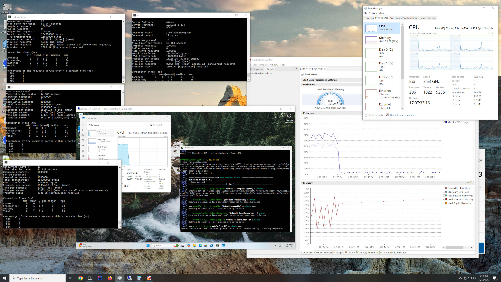

Response time test
==================

#### In short: 73,000 responses per second on a 2014 typical machine.

Performance test:

4,000,000 requests in about 55 seconds, or about 73,000 requests per second

Setup: Ran Minum on a HP Elitedesk 800 G1 SFF with an Intel Core i7-4790 at 3.6 GHz CPU 
running Windows 11.  Stress testing using ApacheBench, version 2.3 revision 1843412, on 
an Intel Core i5-4590 at 3.30 GHz, in four separate Cygwin terminals, on a Windows 10 box.
Connected by ethernet cables to a Verizon router.  All network components were 1000 Mpbs.
Ran Minum by running "make run_sampledomain" and targeted a path of `/hello?name=byron`.  
Expected result was a small HTTP response with a body of "hello byron".

In comparison, for the same setup, Tomcat 11.0.9 ran at 67,340 requests per second when
targeting `/examples/jsp/jsp2/simpletag/hello.jsp`

Screenshot: 

