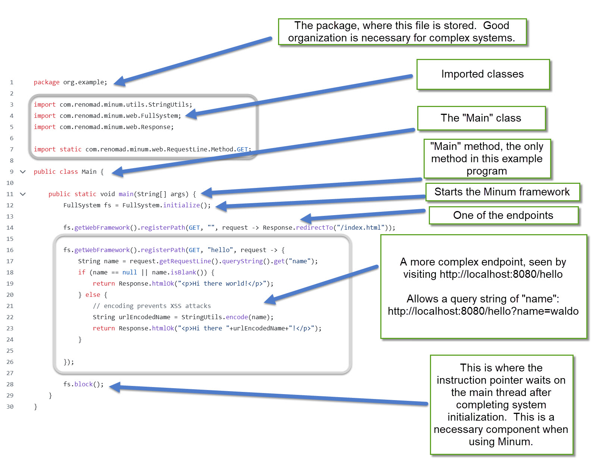

Quick Start
===========

This software will enable you to create web applications in Java.  It provides
the bare minimum of what is necessary for that task, plainly and simply. This quick 
start assumes you have a Posix environment, and have Java 21 or higher installed.  If 
not, see [environment](#environment)


Step 1 - Download the example
-----------------------------

Grab this project which demonstrates a simple approach to using Minum.

Using Git: 

```shell
git clone https://github.com/byronka/minum_usage_example_smaller.git
```

_If you don't have Git_, you can download a zip file of Minum, which will need to be unzipped:

https://github.com/byronka/minum_usage_example_smaller/archive/refs/heads/master.zip


Step 2 - run the example
------------------------

Run this command in its directory:

```shell
./mvnw compile exec:java
```

It will compile and you will be able to view it at http://localhost:8080


Step 3 - Think about the example
--------------------------------

Let's look at the code:




Step 4 - modify the example
---------------------------

* Stop the server and restart by running `./mvnw compile exec:java`
* Change the path - have it serve content from /hi instead of /hello

Next steps
----------

Now you are ready to go further.  If you want a step-by-step tutorial on building a
project with Minum from the ground up, check out the [getting started tutorial](getting_started/getting_started.md).

Or, you may want to pore through a [larger example](https://github.com/byronka/minum_usage_example_mvn)

Have fun!


Environment
-----------

To work with the Minum framework, it is required to have Java 21 or beyond installed. Also,
the development has been done in Posix environments, like the Bash or Zsh shells, or Cygwin
on Windows.

Try this in your shell:

```shell
javac -version
```

The result should be `javac 21` or higher.  If it not, check 
out [Step-by-step guide to installing Java on Windows](development_handbook.md#step-by-step-guide-for-installing-java-on-windows)
or [Java on Mac](development_handbook.md#java-on-mac)

***After changing environment variables, you must close and reopen your terminal to see the change***

Make sure to have the JAVA_HOME environment variable set.  Test like this:

```shell
echo $JAVA_HOME
```

The output should be the directory where Java is installed, but *not* the bin
directory where java and javac live. Try this (this command changes directory to
JAVA_HOME and then lists the files there):

```shell
cd $JAVA_HOME
ls
```

You should see results like: `bin  conf  include  jmods  legal  lib  release`

This is why your `PATH` environment variable should include something like this:

```shell
$JAVA_HOME/bin
```